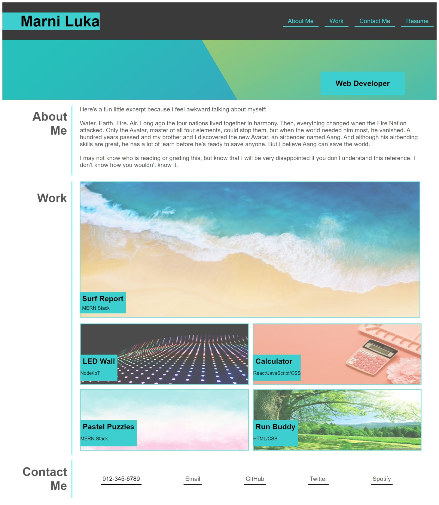

# Portfolio-Mockup

## Description

We were tasked to recreate a website based on the provided image to showcase our current skills and knowledge in both HTML and CSS. This project is a mockup of what a potential portfolio would look like. As you progress through the Bootcamp, you are able to edit and add projects that you make. This is useful for keeping all of your work organized and up-to-date. Future employers can look at this to see one's potential. 

## Usage

The site is very straightforward in use. In the header there is a navbar with four links. When clicked, they will take you to the appropriate section on the page. Resume can be clicked on, but you won't be taken anywhere as there is currently no resume to attach to it.

Furthermore, the images in the work section are also links. As there are no current projects to provide, however, they are not currently linked to anything. This can be edited and added in later on as more projects are created.

[Portfolio Mockup](https://marniluka.github.io/Portfolio-Mockup/)

## Extra

While I didn't actually use anyone else's code but my own, I had some trouble with the image grid, so I attempted to follow a [tutorial](https://www.youtube.com/watch?v=rnhoY5Cdmy0). I was wildly unsuccessful when trying to implement it, so I didn't use it in my code. Therefore, you are getting my laughable attempt of trial and error in creating an image grid that doesn't exactly work the way it should (it only looks proper in the screenshot as it followed that screens sizing). Also had some trouble with creating a proper responsive layout. It somewhat works, but is definitely off.